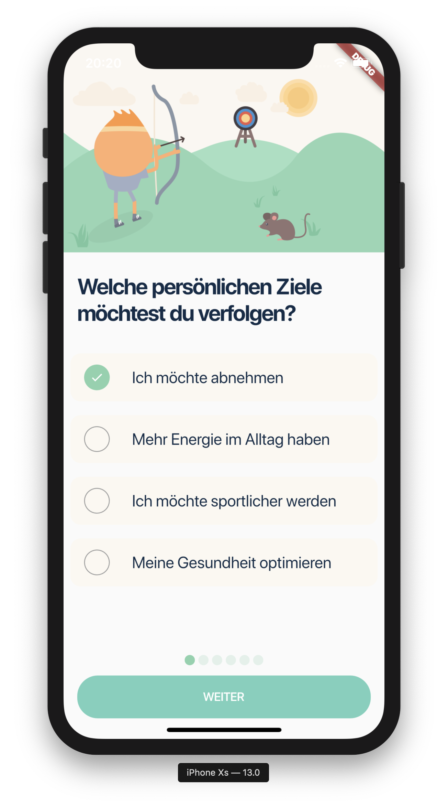
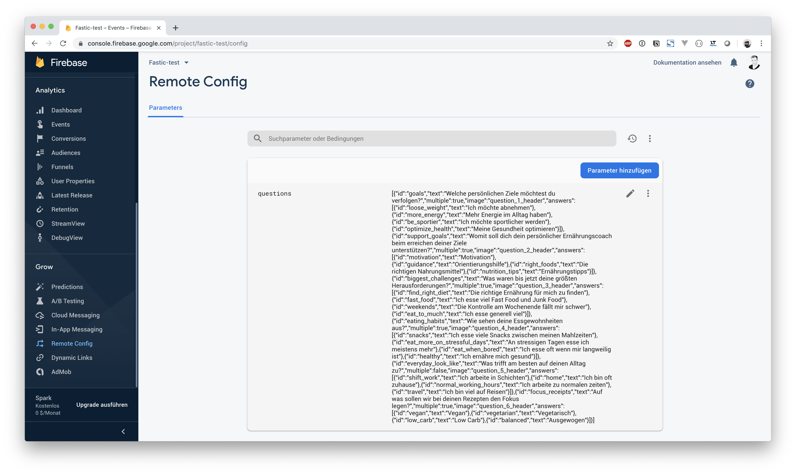

# fastic

Fastic test app

## Getting Started

This project is a Flutter test application. 
Application build an simple questionnaire app and log each question on firebase 
analytics. Questions would be load from firebase remote config.

### Installing

To run the app install packages first with following command

```
flutter pub get
```

Run project on iOS

```
flutter run ios
```

Run project on Andorid

```
flutter run ios
```

Futher information please look at [Flutter Doc](https://flutter.dev/docs)

## Authors

* **Alexander Buder** - *Developer* - [aBuder](https://github.com/aBuder)

## Screenshots App



## Screenshots Firebase



## Questions 

````json
[
    {
        "id": "goals",
        "text": "Welche persönlichen Ziele möchtest du verfolgen?",
        "multiple": true,
        "image": "question_1_header",
        "answers": [
            {
                "id": "loose_weight",
                "text": "Ich möchte abnehmen"
            },
            {
                "id": "more_energy",
                "text": "Mehr Energie im Alltag haben"
            },
            {
                "id": "be_sportier",
                "text": "Ich möchte sportlicher werden"
            },
            {
                "id": "optimize_health",
                "text": "Meine Gesundheit optimieren"
            }
        ]
    },
    {
        "id": "support_goals",
        "text": "Womit soll dich dein persönlicher Ernährungscoach beim erreichen deiner Ziele unterstützen?",
        "multiple": true,
        "image": "question_2_header",
        "answers": [
            {
                "id": "motivation",
                "text": "Motivation"
            },
            {
                "id": "guidance",
                "text": "Orientierungshilfe"
            },
            {
                "id": "right_foods",
                "text": "Die richtigen Nahrungsmittel"
            },
            {
                "id": "nutrition_tips",
                "text": "Ernährungstipps"
            }
        ]
    },
    {
        "id": "biggest_challenges",
        "text": "Was waren bis jetzt deine größten Herausforderungen?",
        "multiple": true,
        "image": "question_3_header",
        "answers": [
            {
                "id": "find_right_diet",
                "text": "Die richtige Ernährung für mich zu finden"
            },
            {
                "id": "fast_food",
                "text": "Ich esse viel Fast Food und Junk Food"
            },
            {
                "id": "weekends",
                "text": "Die Kontrolle am Wochenende fällt mir schwer"
            },
            {
                "id": "eat_to_much",
                "text": "Ich esse generell viel"
            }
        ]
    },
    {
        "id": "eating_habits",
        "text": "Wie sehen deine Essgewohnheiten aus?",
        "multiple": true,
        "image": "question_4_header",
        "answers": [
            {
                "id": "snacks",
                "text": "Ich esse viele Snacks zwischen meinen Mahlzeiten"
            },
            {
                "id": "eat_more_on_stressful_days",
                "text": "An stressigen Tagen esse ich meistens mehr"
            },
            {
                "id": "eat_when_bored",
                "text": "Ich esse oft wenn mir langweilig ist"
            },
            {
                "id": "healthy",
                "text": "Ich ernähre mich gesund"
            }
        ]
    },
    {
        "id": "everyday_look_like",
        "text": "Was trifft am besten auf deinen Alltag zu?",
        "multiple": false,
        "image": "question_5_header",
        "answers": [
            {
                "id": "shift_work",
                "text": "Ich arbeite in Schichten"
            },
            {
                "id": "home",
                "text": "Ich bin oft zuhause"
            },
            {
                "id": "normal_working_hours",
                "text": "Ich arbeite zu normalen zeiten"
            },
            {
                "id": "travel",
                "text": "Ich bin viel auf Reisen"
            }
        ]
    },
    {
        "id": "focus_receipts",
        "text": "Auf was sollen wir bei deinen Rezepten den Fokus legen?",
        "multiple": true,
        "image": "question_6_header",
        "answers": [
            {
                "id": "vegan",
                "text": "Vegan"
            },
            {
                "id": "vegetarian",
                "text": "Vegetarisch"
            },
            {
                "id": "low_carb",
                "text": "Low Carb"
            },
            {
                "id": "balanced",
                "text": "Ausgewogen"
            }
        ]
    }
]

````
